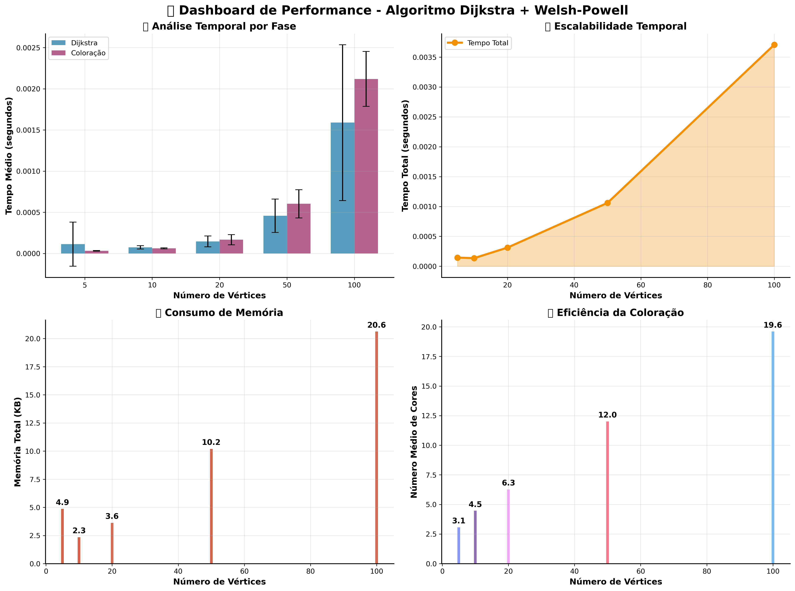
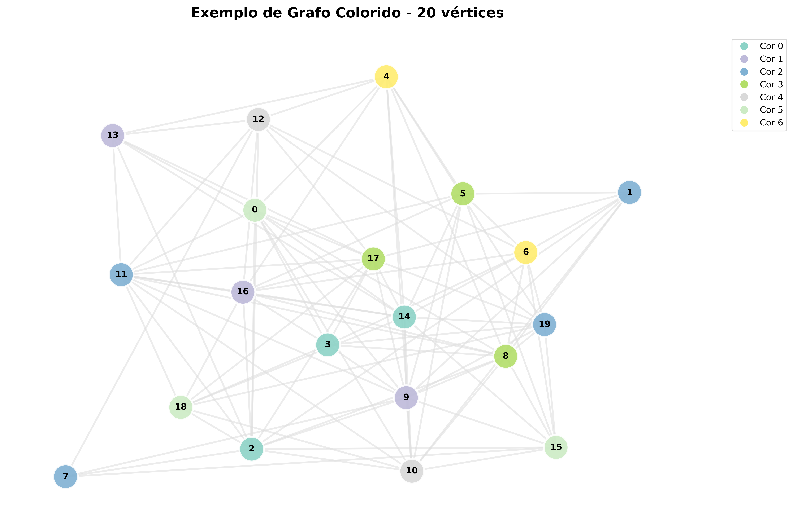

# 🎨 Coloração de Grafos via Dijkstra

> Implementação e análise de um algoritmo híbrido para coloração de grafos utilizando ordenação por Dijkstra seguida de coloração gulosa.

## 📋 Sumário
- [Sobre o Projeto](#-sobre-o-projeto)
- [Tecnologias](#-tecnologias)
- [Requisitos](#-requisitos)
- [Instalação](#-instalação)
- [Uso](#-uso)
- [Análises](#-análises)
- [Resultados](#-resultados)
- [Equipe](#-equipe)

## 🎯 Sobre o Projeto

Este projeto implementa uma abordagem híbrida para coloração de grafos, combinando:
1. Algoritmo de Dijkstra para ordenação dos vértices
2. Coloração gulosa sequencial
3. Análise detalhada de performance e qualidade

## 🛠 Tecnologias

- Python 3.8+
- NetworkX
- Matplotlib
- Seaborn
- NumPy
- Pandas

## 📦 Requisitos

```bash
pip install networkx matplotlib seaborn numpy pandas
```

## 🚀 Instalação

1. Clone o repositório:
```bash
git clone https://github.com/seu-usuario/Colorindo-Grafos-Dijkstra.git
cd Colorindo-Grafos-Dijkstra
```

2. Instale as dependências:
```bash
pip install -r requirements.txt
```

## 💻 Uso

Execute o script principal:
```bash
python main.py
```

O programa irá:
1. Gerar grafos aleatórios de diferentes tamanhos
2. Aplicar o algoritmo híbrido de coloração
3. Produzir visualizações e análises
4. Salvar resultados na pasta `results/`

## 📊 Análises

O projeto realiza análises completas de:
- Tempo de execução (Dijkstra + Coloração)
- Uso de memória
- Número de cores utilizadas
- Estrutura dos grafos gerados
- Escalabilidade do algoritmo

## 📈 Resultados

Os resultados são salvos em `results/`:
- `performance_dashboard.png`: Dashboard completo de performance
- `grafo_colorido_*_vertices.png`: Visualizações dos grafos coloridos
- `relatorio_performance.txt`: Relatório detalhado da análise

### Visualizações Exemplo:

#### Dashboard de Performance


#### Exemplo de Grafo Colorido


## 📝 Características Principais

- Geração inteligente de grafos aleatórios
- Implementação otimizada de Dijkstra
- Coloração gulosa eficiente
- Análise estatística robusta
- Visualizações modernas e informativas
- Relatórios detalhados de performance

## 👥 Equipe

<table>
  <tr>
    <td align="center">
      <a href="https://github.com/alefCauan">
        <br>
        <sub>
          <b style="color: #0366d6;">Alef Cauan</b>
        </sub>
      </a>
    </td>
    <td align="center">
      <a href="https://github.com/DanielRodri87">
        <br>
        <sub>
          <b style="color: #0366d6;">Daniel Rodrigues</b>
        </sub>
      </a>
    </td>
    <td align="center">
      <a href="https://github.com/rayss4lves">
        <br>
        <sub>
          <b style="color: #e83e8c;">Rayssa Alves</b>
        </sub>
      </a>
    </td>
  </tr>
</table>


Link do Projeto: [https://github.com/seu-usuario/Colorindo-Grafos-Dijkstra](https://github.com/seu-usuario/Colorindo-Grafos-Dijkstra)
